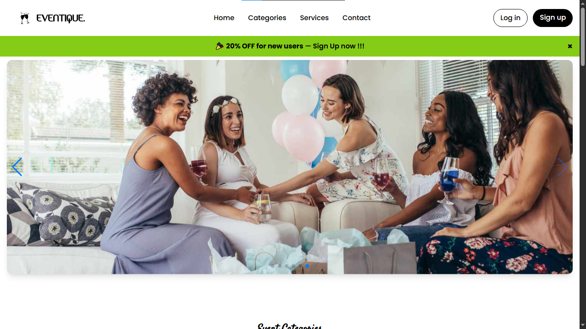
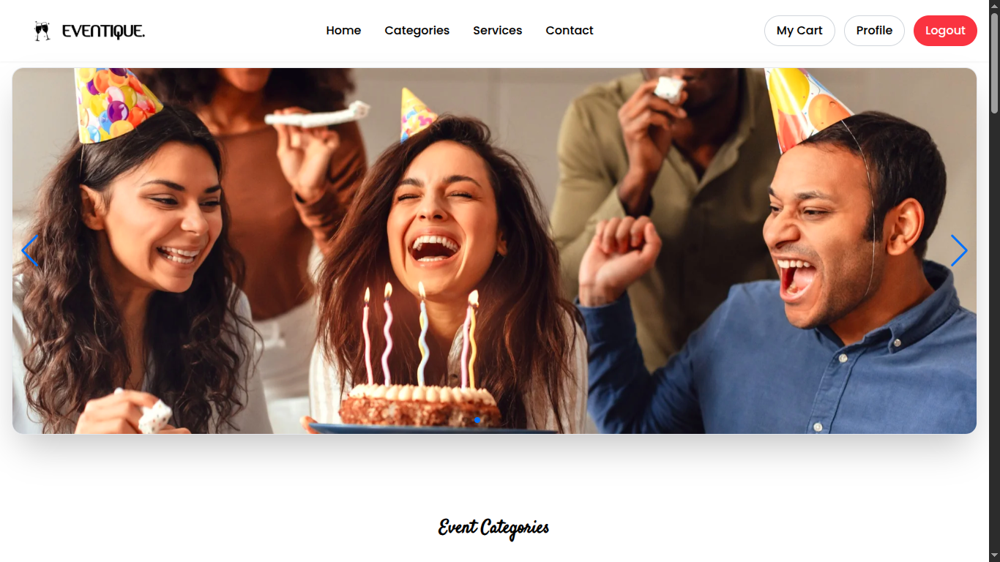
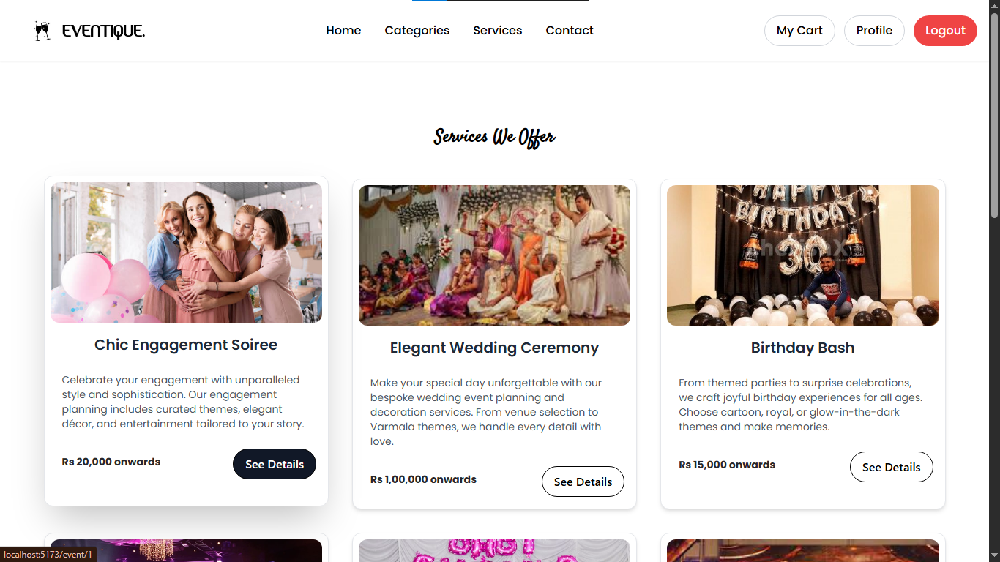

# 🎉 Eventique – Event Management Website

Welcome to **Eventique**, a stylish and modern event management platform built using React + Vite + Tailwind CSS.  
Live Demo: 👉 [https://neweventique.netlify.app](https://neweventique.netlify.app)

---

## 🌟 Overview

Eventique is a fast, elegant, and responsive event management frontend built with modern tools.  
It is perfect for wedding planners, event organizers, and party service providers.

---

## 🚀 Features

- ⚡ Blazing fast with **Vite**
- 🎨 Fully responsive design with **Tailwind CSS**
- 📷 Beautiful image sliders via **Swiper.js**
- 🔄 Smooth client-side routing with **React Router DOM**
- 📦 Organized folder structure and reusable components
- 🎯 Icons using **React Icons**
- 🧹 Linting with ESLint and optimized build setup

---

## 🛠️ Tech Stack

- **Frontend Framework**: React 19
- **Build Tool**: Vite 7
- **Styling**: Tailwind CSS 3
- **Routing**: React Router DOM 7
- **UI Enhancements**: Swiper, React Icons
- **Linting**: ESLint + React Refresh plugin

---

## 📁 Folder Structure (Simplified)

```
event-management-ui/
├── public/
├── src/
│   ├── assets/
│   ├── components/
│   ├── pages/
│   ├── context/
│   ├── routes
│   ├── App.jsx
│   └── main.jsx
├── index.html
├── tailwind.config.js
├── postcss.config.js
├── package.json
└── README.md
```

---

## 📦 Installation

1. Clone the repository:
```bash
git clone https://github.com/newdevatgit/event-management-ui.git
cd event-management-ui
```

2. Install dependencies:
```bash
npm install
```

3. Start the local development server:
```bash
npm run dev
```

---

## 📸 Screenshots

### 🔹 Home page


### 🔹 Home page Logged In


### 🔹 Services


--

## 🌐 Live Demo

👉 [https://neweventique.netlify.app](https://neweventique.netlify.app)

---

## 💡 Future Enhancements

- Add backend integration for real-time event booking
- Form validation and notifications
- Admin dashboard and analytics

---

## 🙌 Acknowledgements

Built with ❤️ using React, Vite, and Tailwind CSS as part of a personal web development project.

---

## ⭐ Show Your Support

If you like this project, give it a ⭐ on GitHub or share it!

---
